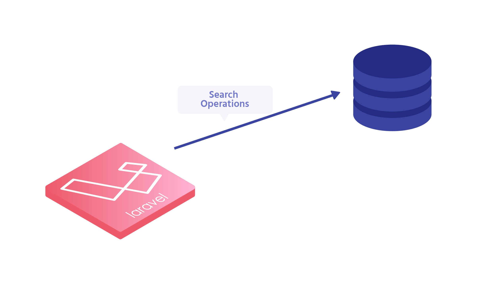
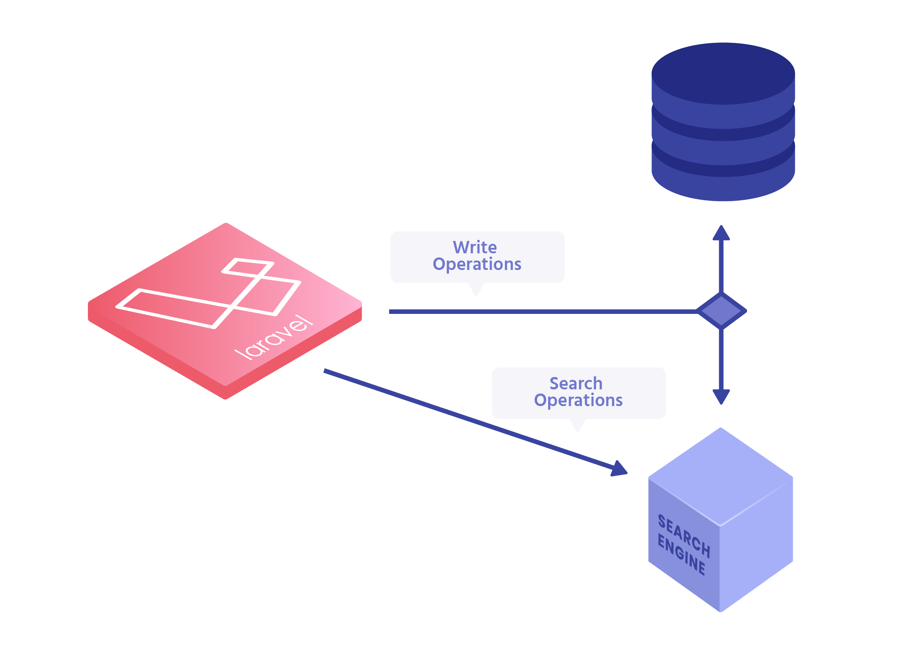

footer: 

^ Pre-demo:
^ 1. In Algolia Dashboard delete news & articles index
^ 2. In Algolia/demo folder perform a `git add . && git reset --hard`.
^ 3. In Algolia/demo folder perform a `art migrate:fresh --seed`
^ 4. Open Sublime Text in Algolia/demo
^ 5. Open Hyper in Algolia/demo
^ 6. Open tabs in chrome: demo.test / algolia.com/dashboard

---

# _**Scout**_
# Extended

---

# [FIT] Search using the Query Builder

```php
$query = (string) request('query');

$models = Post::query()
    ->where('title', 'LIKE', "%$query%")
    ->orWhere('body', 'LIKE', "%$query%")
    ->get();

return view('index', compact('models'));
```

---



[.background-color: #FFFFFF]


---

# [FIT] Scout
#### [FIT] Released by Laravel in _**2016**_

> Driver based solution for adding full-text search to your Eloquent models

---

# [FIT] Search using the Scout

```php
$query = (string) request('query');

$models = Post::search($query)->get();

return view('index', compact('models'));
```

---



[.background-color: #FFFFFF]

---

## Why Search Engine?

### [FIT] Relevance & Speed

---

## Scout is
## Engine-agnostic

---

## Introducing
## [FIT] Scout Extended
#### [FIT] _**It's Laravel Scout with algolia-specific features**_

---

# DEMO

[.list: alignment(left)]

1. Improve the search experience
1. Reindex your data with Zero Downtime
1. Status overview of your indexes
1. Search amongst multiple models with aggregators

---

# DEMO

[.list: alignment(left)]

1. _**Improve the search experience**_
1. Reindex your data with Zero Downtime
1. Status overview of your indexes
1. Search amongst multiple models with aggregators

---

# DEMO

[.list: alignment(left)]

1. Improve the search experience
1. _**Reindex your data with Zero Downtime**_
1. Status overview of your indexes
1. Search amongst multiple models with aggregators

---

# DEMO

[.list: alignment(left)]

1. Improve the search experience
1. Reindex your data with Zero Downtime
1. _**Status overview of your indexes**_
1. Search amongst multiple models with aggregators

---

# DEMO

[.list: alignment(left)]

1. Improve the search experience
1. Reindex your data with Zero Downtime
1. Status overview of your indexes
1. _**Search amongst multiple models with aggregators**_

---

#### macros
#### facades
#### front-end directives
#### and much more!

---

# [fit] 🚀 Just released _**v0.1.0**_
#### github.com/algolia/scout-extended

---

# [fit] Open Source

---

# [fit] github.com/algolia/scout-extended
_**nunomaduro.com**_
Twitter: _**@enunomaduro**_

# [fit] _**QUESTIONS?**_

